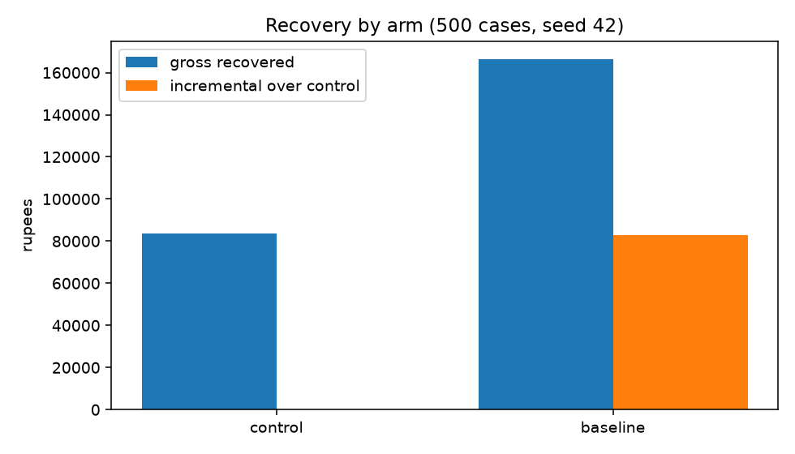
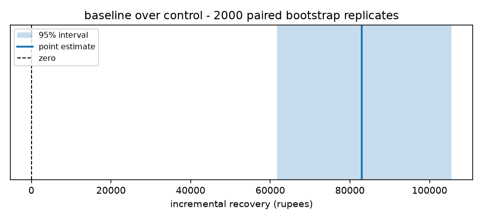
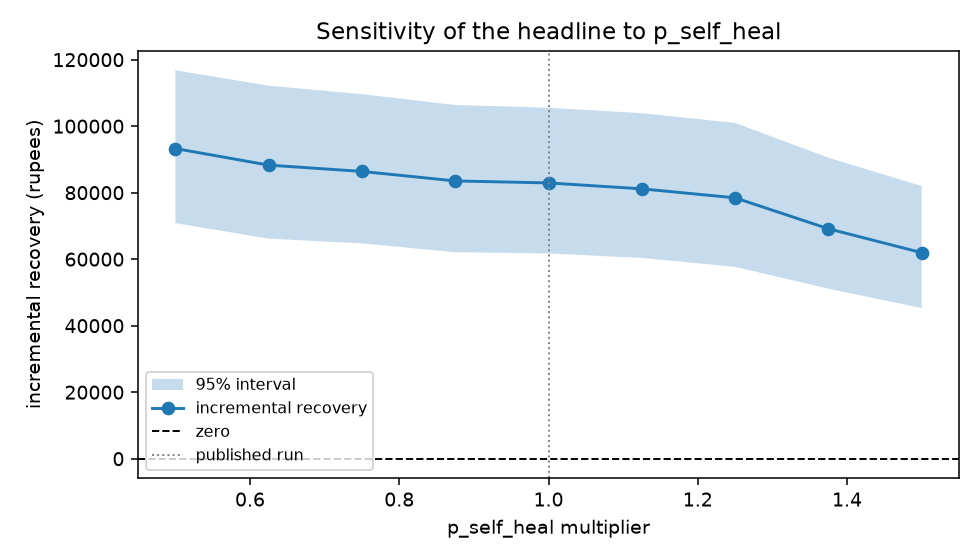
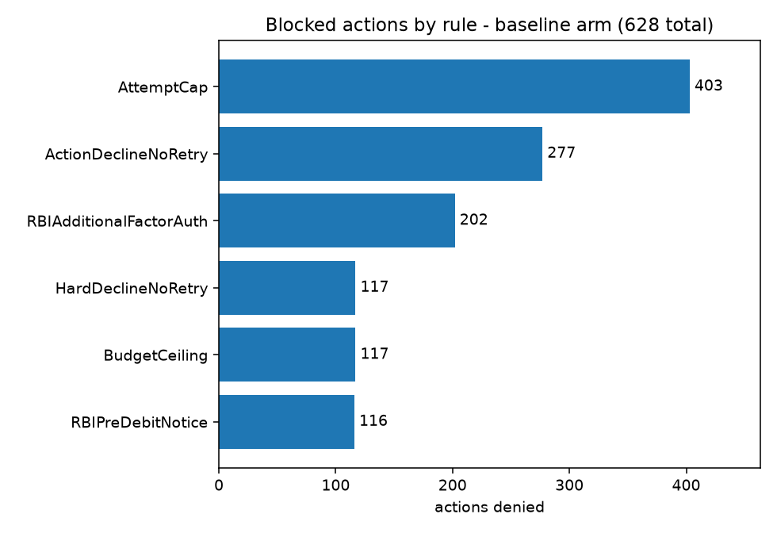

# Recovery — measured incremental revenue recovery

**Razorpay AI Buildathon, Track 03 — AI Revenue Recovery.**

A dunning system for failed recurring payments, and — more to the point — the
measurement apparatus that says how much money it actually recovered. Every number
below is reported as **incremental** recovery against a do-nothing holdout control
arm, because gross recovery counts every payment that would have succeeded anyway.

---

## The result

500 synthetic subscription failures, seed 42, a 14-day (336-hour) recovery window.
Both arms run the **same cohort with the same hidden latents**, and every stochastic
draw is keyed by event identity, so the difference between the arms is attributable to
the intervention rather than to luck.

| arm | recovered | gross | **incremental** | 95% interval | rate | cost | cost per incremental ₹ | mean days to cash | blocked |
|---|---|---|---|---|---|---|---|---|---|
| control (holdout) | 101/500 | ₹83,620 | — | — | 20.2% | ₹0 | — | 7.04 | 0 |
| baseline (T+3 retry) | 190/500 | ₹166,551 | **₹82,931** | [₹61,719, ₹105,546] | 38.0% | ₹1,926 | ₹0.023 | **3.70** | 628 |



**95% confidence interval on the incremental figure: [₹61,719, ₹105,546]**
(2,000 paired bootstrap replicates, resampled by case, seed 42). The interval excludes
zero.

**The treated arm also gets the money 3.34 days sooner** — 3.70 days to cash against the
holdout's 7.04. That gap is worth stating separately from the headline: the same rupee
arriving three days earlier is worth something in working capital, and it is a real
result even on the cases both arms would have recovered anyway.



> **An interactive readout of everything below is in [`index.html`](index.html)** —
> the effect estimate, the bootstrap distribution behind the interval, where the two arms
> diverge day by day, the sensitivity sweeps, and a **replay of any one of the 500 cases**:
> pick a case, scrub the 336-hour window, and watch both arms hour by hour, including every
> action the policy engine refused and the rule text it refused with.
>
> The replay is a **replay of the committed ledger, not a simulation running in the
> browser**. Nothing on that page is computed there; a page that re-derived these numbers
> in JavaScript would be publishing figures that do not reproduce from the seed, which is
> the one thing this repository exists to rule out. The sensitivity slider moves between
> *computed* sweep points and never interpolates one.
>
> Open the file directly — a single self-contained page, data and fonts inlined, no server
> and no network. It is **generated** from the committed ledgers by
> `python scripts/build_viewer.py`, so it cannot disagree with what the command line
> prints, and it is not part of the measurement pipeline — deleting it changes no number.

### The number that makes this honest

**The control arm recovers ₹83,620 on its own, without anyone doing anything.**
20.2% of failed payments in this model heal by themselves — cards get topped up,
balances arrive on payday, transient issuer errors clear.

So a system that reported its **gross** ₹166,551 would be claiming credit for
**2.0× the money it actually caused**. That gap is the entire reason this repository
has a control arm in it, and it is the number worth arguing about on the video.

### Does the result survive its own assumptions?

Three parameters are swept ±50%, at nine points each. The question is never whether
the *magnitude* holds — a magnitude under a synthetic model is not evidence — but
whether the **sign** does.

```
python -m recovery.cli sweep --param p_self_heal   --range 0.5,1.5 --points 9
python -m recovery.cli sweep --param attempt_decay --range 0.5,1.5 --points 9
python -m recovery.cli sweep --param retry_cost    --range 0.5,1.5 --points 9
```

**`p_self_heal` — the self-heal rate.** Our own prior, not a quoted figure, and the
assumption the whole critique rests on.

| × | value | incremental | 95% interval | cost/incr ₹ |
|---|---|---|---|---|
| 0.50 | 0.5 | ₹93,275 | [₹70,840, ₹116,810] | ₹0.021 |
| 0.75 | 0.75 | ₹86,390 | [₹64,744, ₹109,633] | ₹0.022 |
| **1.00 (published)** | 1.0 | **₹82,931** | **[₹61,719, ₹105,546]** | ₹0.023 |
| 1.25 | 1.25 | ₹78,454 | [₹57,690, ₹100,984] | ₹0.024 |
| 1.50 | 1.5 | ₹61,957 | [₹45,305, ₹81,988] | ₹0.031 |



The lift shrinks as self-healing rises, which is the direction it must move: the more
cases recover unaided, the less room an intervention has to add value.

**`attempt_decay` — how fast a retry's success probability decays.**

| × | value | incremental | 95% interval | cost/incr ₹ |
|---|---|---|---|---|
| 0.50 | 0.20 | ₹50,420 | [₹33,644, ₹69,155] | ₹0.042 |
| 0.75 | 0.30 | ₹68,859 | [₹49,023, ₹90,740] | ₹0.030 |
| **1.00 (published)** | 0.40 | **₹82,931** | **[₹61,719, ₹105,546]** | ₹0.023 |
| 1.25 | 0.50 | ₹91,234 | [₹68,996, ₹115,184] | ₹0.021 |
| 1.50 | 0.60 | ₹96,668 | [₹74,402, ₹121,441] | ₹0.020 |

**`retry_cost` — the assumed ₹3 per retry.**

| × | value | incremental | 95% interval | cost/incr ₹ |
|---|---|---|---|---|
| 0.50 | ₹1.50 | ₹82,931 | [₹61,719, ₹105,546] | ₹0.012 |
| **1.00 (published)** | ₹3.00 | **₹82,931** | **[₹61,719, ₹105,546]** | ₹0.023 |
| 1.50 | ₹4.50 | ₹82,931 | [₹61,719, ₹105,546] | ₹0.035 |

The recovery figure does not move at all across the cost sweep, and that is worth
explaining rather than glossing. Cost reaches the policy engine through `BudgetCeiling`,
which refuses to spend more on a case than it is expected to recover — so cost *can*
change behaviour. It does not here, for two reasons that were checked rather than
assumed: all 117 `BudgetCeiling` refusals in the published run are cases whose expected
recovery is **zero** (a hard decline, where the rule spends nothing at all), and among
the actions it allowed, the tightest remaining headroom was ₹5.98 while a 1.5× retry adds
only ₹1.50. No verdict can flip inside the swept range. The cost assumption therefore
moves cost per incremental rupee — from ₹0.012 to ₹0.035, a 3× swing — and nothing else.

**The verdict: the sign survives in all three sweeps, and the interval clears zero at
9/9 points in each.** The result is not an artifact of the one parameter we chose to
sweep.

---

## What is not here, and why

**There is no agent-arm number in the table above.**

The agent layer is built. `recovery/agent/` implements a policy-gated
`client.beta.messages.tool_runner` loop over six tools, and `tests/test_agent_gating.py`
covers it with 23 tests — including proof that a policy-denied tool call never reaches
the transport, that a denial writes a ledger entry with its `rule_id` and no action,
and that replay reproduces a recorded plan exactly with no API key present.

**The `ANTHROPIC_API_KEY` it was designed around never arrived**, so the arm could not
be recorded against Claude at all. In the final hours before submission a Groq-hosted
open model (`openai/gpt-oss-120b`) was wired in as an alternative planner via
`--provider groq`. This is a smaller change than it sounds: the policy gate lives
*inside the tool functions*, not in the model loop, so the six tools, their schemas and
every rule that screens them are identical whichever model is planning. Groq recordings
are kept in their own cassette namespace, because two providers answer the same prompt
differently and replaying one into the other would be a silent cross-provider miss.

**Cassettes exist for 5 of the 500 cases, and no agent-arm figure is published from
them.** Five cases cannot support a bootstrap interval, and a five-case run is not
comparable to the 500-case table above. Quoting a number from it would be exactly the
kind of claim this repository was built to argue against.

What the pilot does show, stated as an observation and not as a result: across those 5
cases the agent took 6 actions — 4 retries, 1 message, 1 close — and one of its three
recoveries was caused by a **contact** rather than a retry. That is a move the
retry-only baseline has no way to produce. Whether it pays for itself at scale is
precisely the question 5 cases cannot answer.

**It is not evidence that the gate binds in a live run.** None of those 6 actions were
denied, so the pilot exercised the happy path only. The evidence that the policy engine
actually refuses things remains where it was: 628 denied actions in the baseline arm,
12 rules evaluated on every one of 1,270 checks with no short-circuit, and 23 tests in
`tests/test_agent_gating.py` — including proof that a denied tool call never reaches
the transport.

The measurement spine does not depend on any of this. Control versus baseline is a
complete, reproducible, interval-bounded result on its own, and the agent arm slots
into the same harness the moment a full set of cassettes exists.

**Contact fatigue is computed and reports zero.** `report` prints mean and P95 contacts
per customer, and both arms show 0.00 across all 265 customers. That is not a broken
metric — the baseline arm is deliberately retry-only ("no contact, no reason-awareness,
no notices"), so there is nothing to be fatigued by. The metric exists because it is the
guardrail on the *agent* arm, which is the one that would message people. Until that arm
is recorded, it has no signal to report, and reporting it as zero is more honest than
quietly dropping the column.

---

## Reproduce it

Python 3.11+. No API key, no network, no credentials of any kind.

```bash
python -m venv .venv && source .venv/Scripts/activate   # Git Bash
python -m venv .venv ; .\.venv\Scripts\Activate.ps1     # PowerShell
python -m pip install -e ".[dev]"
```

```bash
python -m recovery.cli eval --seed 42 --n 500 --arms control,baseline
python -m recovery.cli report          # table, intervals, fatigue, refusals, figures
python -m recovery.cli sweep --param p_self_heal --range 0.5,1.5 --points 9
python -m recovery.cli repro           # the reproduction gate
python scripts/build_viewer.py         # regenerate index.html from the ledgers
pytest                                 # 356 tests, 2 skipped without Razorpay keys
```

`repro` is the one that matters, and it runs in two modes.

**The default clones `HEAD` into a temp directory, builds a fresh virtualenv there,
installs from `pyproject.toml` alone, runs `eval`, and byte-compares the result against
the committed artifacts** — with `ANTHROPIC_API_KEY` and the Razorpay keys stripped out
of the child environment, so it proves the published numbers need no credentials even on
a machine that has them.

The fresh virtualenv is the entire point. A gate that re-derives the numbers inside the
development `.venv/` cannot tell you whether `pyproject.toml` declares everything the
project needs, because every dependency is already importable there — it would pass with
a missing dependency, and a reviewer cloning the repository would then hit the
`ImportError` you did not.

```
  [PASS] project materialises into a temp dir      cloned HEAD
  [PASS] fresh virtualenv created                  .venv
  [PASS] pyproject declares every dependency       installed from pyproject alone
  [PASS] eval runs with no credentials present     completed offline
  [PASS] cohort matches the committed artifact     145,696 bytes identical
  [PASS] control ledger matches the committed artifact    276,972 bytes identical
  [PASS] baseline ledger matches the committed artifact  4,025,832 bytes identical
```

`--worktree` materialises the working tree instead of `HEAD`, for checking a
reproduction before the work that produces it has been committed.

**`--in-process` is the fast path** — a few seconds rather than a few minutes. It
re-derives every artifact in the current interpreter and byte-compares, then verifies
each ledger's hash chain:

```
  [PASS] cohort has the manifest's case count   500 lines, manifest says 500
  [PASS] cohort reproduces from the seed        145,696 bytes identical
  [PASS] control ledger reproduces              276,972 bytes identical
  [PASS] baseline ledger reproduces             4,025,832 bytes identical
  [PASS] control hash chain verifies            append-only chain intact
  [PASS] baseline hash chain verifies           append-only chain intact
```

Either mode checks the cohort's line count separately from its contents, because a
truncated cohort is a byte-identical *prefix* of the real one and would otherwise pass.
That check exists because the truncation actually happened — see `WHAT_BROKE.md`
incident 2.

---

## Compliance and the audit trail

Every money movement and every customer contact routes through
`PolicyEngine.evaluate()`. Twelve rules run — nine operational, three RBI — and
**the engine does not short-circuit**: all rules run on every action and the ledger
records every verdict, pass and fail. The denials *are* the blocked-action log.

The baseline arm had **628 actions denied**:

| rule | denials | what it enforces |
|---|---|---|
| `AttemptCap` | 403 | stopping rule — retries per case are bounded |
| `ActionDeclineNoRetry` | 277 | expired cards and revoked mandates are never silently retried |
| `RBIAdditionalFactorAuth` | 202 | AFA above ₹15,000 (₹1,00,000 for insurance / MF / credit-card bills), and on every first debit |
| `BudgetCeiling` | 117 | stopping rule — spend per case is bounded |
| `HardDeclineNoRetry` | 117 | stolen and blocked cards are never retried |
| `RBIPreDebitNotice` | 116 | 24-hour pre-debit notification before an e-mandate debit |



Counts exceed 628 because a single denied action is objected to by every rule that
disagrees with it, not merely the first — which is the point of not short-circuiting.

`tests/test_policy_rbi.py` is the compliance evidence, and its test names read as a
description of the regulation. Every threshold is tested from **both** sides —
₹15,001 denied *and* ₹14,999 allowed, 23h59m denied *and* 24h01m allowed — because a
one-sided boundary test cannot tell a correct rule from a rule that always denies.
That lesson has a number attached too; it is incident 1 in `WHAT_BROKE.md`.

The ledger is append-only and hash-chained. There is no update path and no delete
path in `recovery/ledger.py`.

---

## How the measurement works

Three properties do the work:

**The holdout is real.** The control arm takes no actions at all. Its recovery number
is the counterfactual that turns every other arm's gross figure into an incremental
one.

**The arms are paired.** Every stochastic draw comes from a blake2b helper keyed by
`(seed, case_id, event_kind, sequence)` — never a sequential RNG stream. A case that
self-heals at hour 137 in the control arm self-heals at hour 137 in every other arm
too, unless an intervention changed its fate first. This is what makes a 500-case
cohort informative enough to bound; it is also why the bootstrap resamples *cases*
carrying both arms' outcomes rather than resampling each arm independently.

**The ground truth is hidden structurally, not by convention.** `Case.latents` —
true intent to pay, channel affinities, self-heal propensity — is read only by the
simulator. Arms observe through `CaseState`, which has no field to put a latent in.
The scorer in `recovery/scoring.py` therefore *guesses*, and its docstring records
exactly where it is wrong: it assumes uniform willingness to pay, its attempt-decay
curve deliberately differs from the simulator's, and it has no payroll-cycle term.
A scorer fitted to the generative model would be an oracle, and its number would mean
nothing.

Architecture, and the two places this repo deliberately departs from the obvious
approach, are in **`ARCHITECTURE.md`**. The incident log is **`WHAT_BROKE.md`**.

---

## Limitations

State them here rather than let a reader find them.

- **The cohort is synthetic.** No real Razorpay transaction data was available. The
  decline mix, amount distribution and self-heal rates are our own priors, informed by
  published industry figures but not measured. This is why the sweep exists.
- **The costs are priors too.** ₹3.00 per retry attempt, ₹0.20 SMS, ₹0.35 WhatsApp,
  ₹0.01 email. They are swept, not quoted.
- **One seed is published.** The interval comes from bootstrapping within seed 42's
  cohort, not from resampling cohorts across seeds. It bounds sampling variation
  within this cohort, not the variation between cohorts.
- **The baseline is a fixed T+3 policy**, which is a plausible incumbent but not a
  measurement of what Razorpay actually does.
- **No agent-arm result**, as described above.
- **No live payment integration.** The mock transport is the default and the only one
  exercised; `Transport` is a Protocol so a live implementation is additive, but none
  was built.

---

## Repository map

```
recovery/
  cohort.py            synthetic cohort + the blake2b CRN helper `u()`
  declines.py          decline taxonomy — SOFT / HARD / ACTION, unknown codes raise
  ledger.py            append-only hash-chained audit ledger
  scoring.py           P(recover | intervention), deliberately not the simulator's model
  transport/
    base.py            the Transport protocol; CaseState, which cannot carry latents
    mock.py            the deterministic 336-hour outcome model (reads latents)
    razorpay_test.py   live test-mode transport — wired, never run, never published from
    webhooks.py        inbound payment status, handled as at-least-once
  policy/
    engine.py          evaluate() — runs every rule, short-circuits none
    rules.py           nine operational rules
    rbi.py             three RBI rules, with inline citations
  arms/
    control.py         the holdout — the measurement instrument
    baseline.py        Razorpay's T+3 default
    agent.py           policy-gated agent arm (built; no cassettes recorded)
  agent/               tool_runner loop, six @beta_tool functions, cassette record/replay
  eval/
    harness.py         three-arm runner, one ledger per (run, arm)
    metrics.py         incremental recovery, paired bootstrap intervals
    report.py          report + sensitivity sweep
    repro.py           the reproduction gate
data/
  cohort_seed42.jsonl  the published cohort (latents in a side table the arms never read)
  results/             committed ledgers, manifest, figures
index.html             the generated readout — never hand-edited
scripts/build_viewer.py  generates it from the same ledgers `report` reads
tests/test_adversarial.py  the five adversarial passes; see WHAT_BROKE.md for what they cost
```

All money is integer paise everywhere. Rupees appear only at the display boundary.
